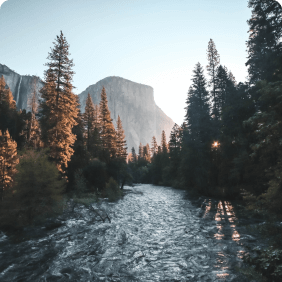

# Project 3: Around The U.S.

### Overview

### Overview

- Intro
- Figma
- Images

- Intro
- Figma
- Images

**Intro**

This webpage incorporates different elements using flexbox and grid layouts to display professional photos on different device sizes.

Using popular dimensions, the content will be viewable on desktops, tablets, and most mobile devices with screens as small as 320px.

The content currently displayed features photographs from explorer Jacques Cousteau. These photos present the landscapes of various mountains, lakes, and rivers found across their journey across the globe.

**Figma**

- [Link to the project on Figma](https://www.figma.com/file/ii4xxsJ0ghevUOcssTlHZv/Sprint-3%3A-Around-the-US?node-id=0%3A1)

- [Link to the project on GitHub](https://felixg105.github.io/se_project_aroundtheus/)

- [Linke to the project Video Description](https://drive.google.com/file/d/1MsaxQj20udp0lUFRYfCK09OsQpLy0GsR/view?usp=sharing)

**Images**
These photos are currently displayed as part of Jacques' journey.

Displays a river cutting through a valley within Yosemite National Park as the sun sits behind the trees

A scenic and calming image of Lake Louise. The smokey blue water reflects the clear sky and snow capped mountains nearby.

The sun hovers just above the horizon, glowing orange. The bright ray spread across the landscape and highlt the silhouette of the tree covered hills below.

The night sky is illuminated with stars over the Latemar mountains in Italy. Despite the lack of sunlight illuminating the landscape, the night sky presents shades of blue, green, and grey in a way few can claim to see in person.

A calming shoreline within Vanoise National Park. The clear sky glows with shades of pink and blue while the grounds provide contrast with dark shadows and a clear relfection of the mountains in the distance.

Another classic image displaying the calming natural beauty of the Italian Dolomites. This scenic lake is complimented with small boats tied to a local dock. They are overshadowed by the powerful mountain valley waiting in the distance.
